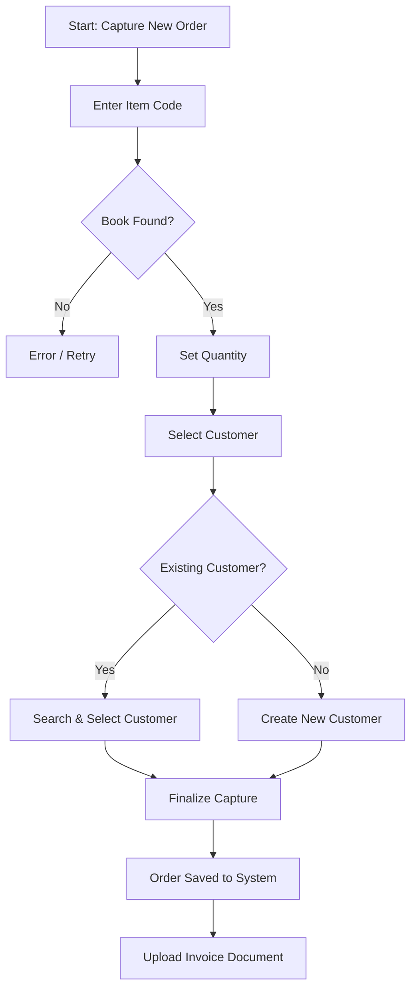

# Capture Orders Guide

The **Capture Orders** module allows admins to record and manage book orders placed by customers.

## Workflow

## Step-by-step Instructions

1. **Navigate to Orders**: Click on the *Capture Orders* link in the Admin Dashboard.
2. **Initiate Capture**: Click the `Capture Order` button to open the capture modal.
3. **Find the Book**: Enter the book's Item Code (Found on the Good Neighbours site) and click `Search Book`. The system will fetch the book's details (Title, Author, Price, Cover).
4. **Set Quantity**: Enter the number of copies required.
5. **Assign Customer**:
    - **Existing Customer**: Search for the customer's name and select them.
    - **New Customer**: Switch to the *New Customer* tab and enter their First Name, Last Name, Phone, and optionally Email.
6. **Finalize**: Click `Finalize Capture` to save the order.
7. **Manage & Invoice**: The order will now appear in the Orders table. You can click `Upload` under the Invoice column to attach the supplier invoice (PDF or Image) to the order.
