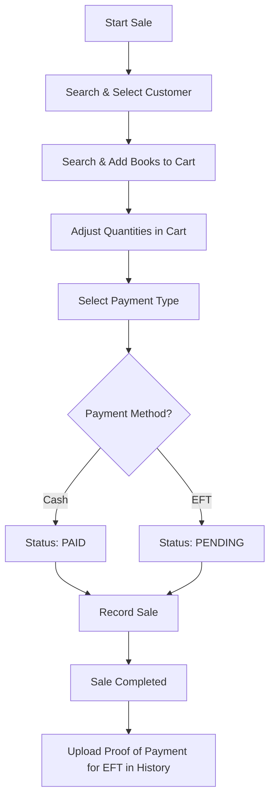

# Capture Sales Guide

The **Capture Sales** module is the Point of Sale interface for the system. It allows admins to process purchases and track sales history.

## Workflow

## Step-by-step Instructions

### 1. Processing a New Sale
1. **Select Customer**: Search for and select the customer making the purchase.
2. **Add Items**: Search for books in the inventory and add them to the cart.
3. **Review Cart**: Adjust quantities or remove items as needed. The total amount will update automatically.
4. **Payment Details**:
    - **CASH**: Select Cash. The payment status automatically defaults to `PAID`.
    - **EFT**: Select EFT. The payment status automatically defaults to `PENDING`.
5. **Record Sale**: Click `Record Sale` to finalize the transaction.

### 2. Managing Sales History
1. Switch to the **Sales History** tab on the Capture Sales page.
2. View past sales, their totals, and their payment statuses.
3. **Pending Payments**: For EFT payments that are marked as `PENDING`, you can upload a Proof of Payment (PoP) document once the customer has transferred the funds. Once verified, the status can be updated to `PAID`.
