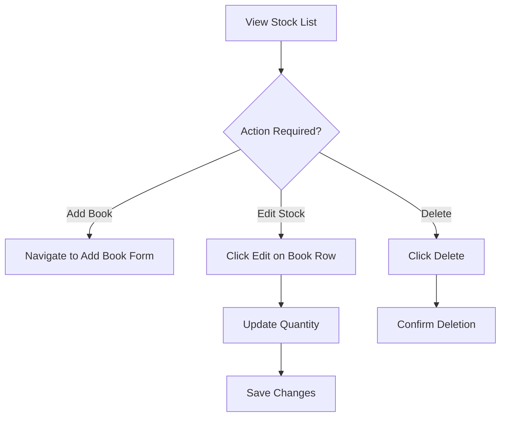

# Stock Management Guide

The **Stock Management** module allows admins to view, update, and remove books from the inventory.

## Workflow

## Step-by-step Instructions

1. **Search & Filter**: Use the search bar to find books by Title, Author, or Code (ISBN).
2. **Update Stock Quantity**:
    - Click the `Edit` (pencil) icon next to a book.
    - Enter the new stock quantity.
    - Click the `Save` (checkmark) icon to apply changes, or `Cancel` (X) to abort.
3. **Add New Books**: Click the `Add Book` button at the top right to open the book creation form, where you can add new inventory items to the system.
4. **Delete Books**: Click the `Delete` (trash) icon and confirm to permanently remove a book from the system. *Note: Use with caution.*
