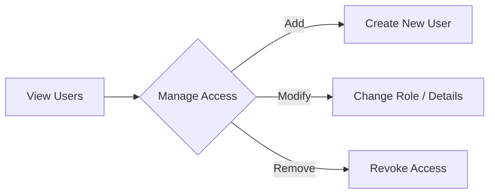

# User Management Guide

The **User Management** module is for administering system access, controlling who can log in, and what roles they hold.

## Workflow

## Step-by-step Instructions

1. **Accessing Users**: Navigate to the User Management page from the Admin dashboard.
2. **Overview**: View the list of all registered users, their contact information, and their assigned roles (e.g., Admin, Staff).
3. **Managing Roles**: Ensure that only authorized personnel are granted Admin rights, as this provides access to sensitive financial and stock data.
4. **Creating/Editing Users**: Use the interface to add new staff members to the system or update details for existing ones.
